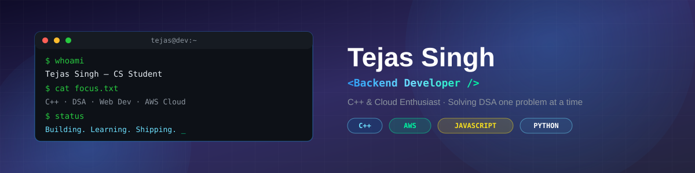

<h1 align="center">Hi 👋, I'm Tejas Singh</h1>
<h3 align="center">🎓 Computer Science Student | 💻 Aspiring Software Developer</h3>
<h4 align="center">Backend & Cloud Enthusiast | Focused on DSA, Web Development, CPP & Cloud Computing</h4>

  

  

  
  
  
  

---

### 🚀 About Me

- 🔹 Solving Data Structures & Algorithms problems regularly
- 🔹 Building web applications using HTML, CSS & JavaScript
- 🔹 Developing backend APIs in Java
- 🔹 Learning Cloud Computing (AWS fundamentals)
- 🔹 Exploring Spring Boot & Git/GitHub workflows
- 💬 Ask me about: DSA, Java backend development, or AWS basics

---

### 🛠️ Tech Stack

**Programming Languages**

**Web Development**

**Cloud & Tools**

**Databases**

---

### 📚 Data Structures & Algorithms

- ✅ Arrays, Strings, Linked List
- ✅ Stack, Queue
- ✅ Trees & Binary Trees
- ✅ Recursion & Backtracking
- 🔄 Graphs & Dynamic Programming *(in progress)*

📌 Practicing on **LeetCode** & **Codeforces**

---

### 🚀 Projects

**🔹 DSA Practice Repository**
- 📂 Topic-wise DSA problems
- 🧠 Clean & optimized solutions
- 🛠️ Language: C++ / Java

**🔹 Java REST API**
- 🔹 CRUD APIs
- 🔹 Backend logic using Java
- 🔹 RESTful architecture

**🔹 Web Projects**
- 🌦️ Weather App (HTML, CSS, JS)
- 📝 To-Do List App
- 🧮 Calculator

**🔹 Cloud Learning Notes**
- ☁️ AWS services (EC2, S3, IAM)
- 📘 Concepts & architecture notes

---

### 📊 GitHub Stats

  
  

  

---

### 🌐 Connect With Me

  
  

<h4 align="center">⭐ Always learning, building, and improving — one commit at a time.</h4>
